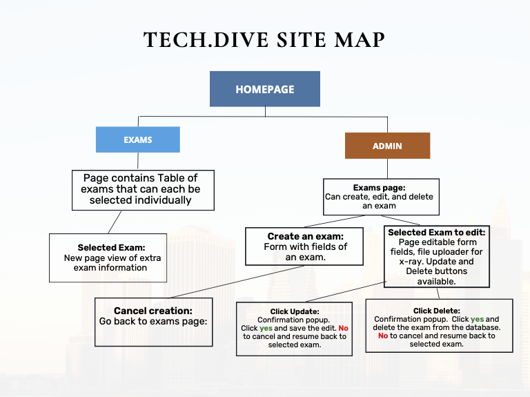

# 👩‍⚕️ Pythons Medical Center 👨‍⚕️
Pythons Medical Center is an web application for doctors to track patient information related to COVID-19 using radiology reports. The primary goal of this application is to provide doctors with an easy-to-use interface that allows them to quickly record and access radiology reports for patients they are treating.

## 👩🏽‍🚀 Feature List:
This application will allow doctors to:
* view a list of patients, their radiology reports, and x-ray images
* can create, edit, and delete reports as needed
* include advanced search features to allow doctors to quickly find reports for a specific patient

## 🎨 Wireframe/ Diagram

## 🚀 MVP:
The application will be designed to support the Create, Read, Update, and Delete (CRUD) operations for structured radiology reports as an assessment of x-ray images for exams of patients with COVID-19. The system will have a user-friendly interface that allows doctors to upload x-ray images, create radiology reports, and manage patient information. Overall, this web application will provide doctors with an efficient and effective tool for tracking patient information related to COVID-19 using radiology reports.

## 🥳 Post MVP (Extras)
* Update your data model to split “reports” into a separate table. This allows us to separate the subjective assessment of an exam by a radiologist from the key objective features of the exam, so that we can compare multiple assessments of the same exam. 
* Import data from a CSV into your tables (using a script is fine)
* Export data from the tables into a CSV for sharing (using a script is fine)
* Add authentication to your web application by using existing technology like Google Oauth
* Add automated testing for the server

## 🔨 Back-end Endpoints

Routes:
* view all: "/patient/:patientId"
* create new: "/"
* update one: "/:id"

## 📦 List Dependencies 

Front-End:
* React
* HTML
* CSS
* Axios

Backend:
* Node.js
* Express
* MongoDB

## 👨‍💻 Authors
* Victor Ibitoye
* Tilon Bobb
* Haidy Hussein
* Natasha Piedrabuena
* George Sucuzhanay

## ✨ Special Thanks:
* Hack.Diversity Team
